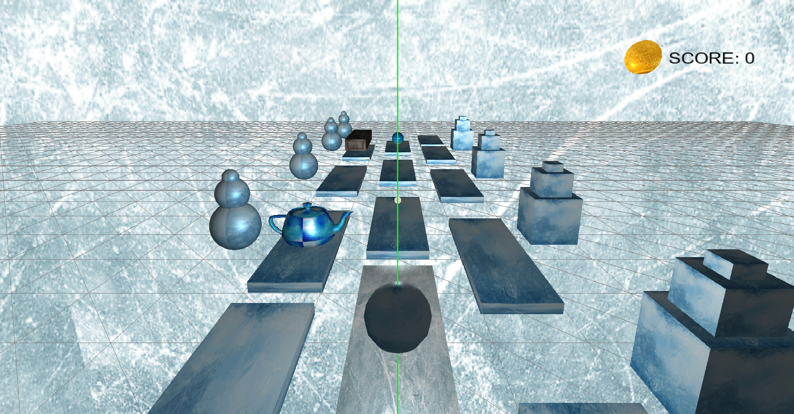

# Skyroads Runner Game

### This application is a 3D game developed in OpenGL and C++.

#### The game features a snowball, that wants to collect as many snow as possible, while jumping on platforms and avoiding obstacles.

>##### After developing this game is learned how to:
>
> - apply textures.
> - use a First-Person/Third-Person Camera
> - apply differents types of lightning to objects
> - create and design 3D meshes
> - design custom objects
> - *more about GLSL and C++* .
